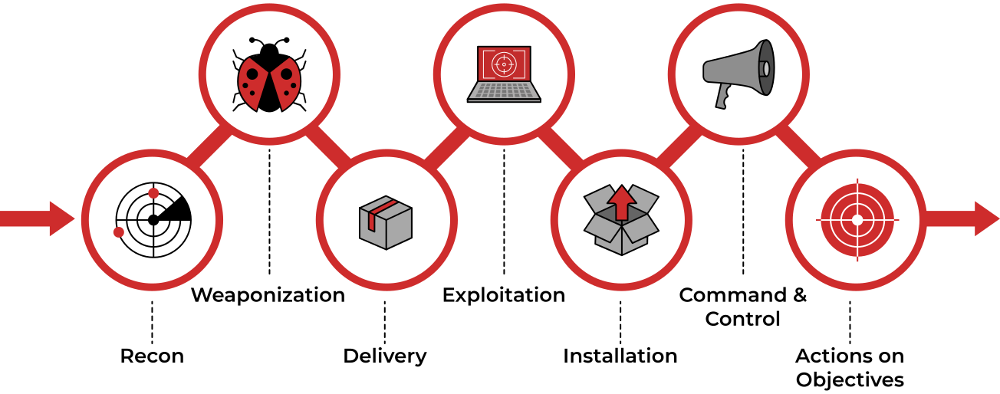
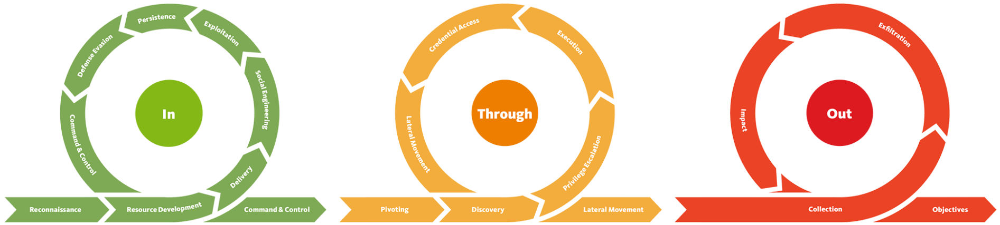

# KILLCHAINS

The term kill chain is a military concept which identifies the structure of an attack. It consists of:

- identification of target
- dispatching of forces to target
- initiation of attack on target
- destruction of target

Conversely, the idea of "breaking" an opponent's kill chain is a method of defense or preemptive action

[infographic](../img/kill_chain_infographic.png)

The concept has been applied by numerous actors in the I.T. field so, even thought the basic idea remains the same, you'll find different Frameworks carrying different approaches of the killchain concept.

Here are the most notorious ones to remember.

## CYBER KILL CHAIN
[CYBER KILLCHAIN'S WEBSITE](https://www.lockheedmartin.com/en-us/capabilities/cyber/cyber-kill-chain.html)

## UNIFIED KILLCHAIN
[UNIFIED KILLCHAIN'S WEBSITE](https://www.unifiedkillchain.com/)

## INTRUSION KILLCHAIN

