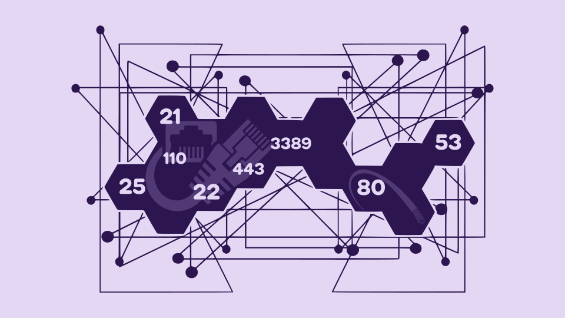

# PROTOCOLS AND PORTS

In networking, a protocol is a set of rules for formatting and processing data.
There are a lot of protocols in I.T., some well-known surch as HTTP and IMAP, and others that are still well-worth knowing like LDAP.

## WELL-KNOWN PORTS

- 21 &rarr; FTP
- 22 &rarr; SSH
- 23 &rarr; TELNET
- 25 &rarr; SMTP
- 53 &rarr; DNS
- 67 &rarr; DHCP Server
- 68 &rarr; DHCP Client
- 80 &rarr; HTTP
- 88 &rarr; KERBEROS
- 110 &rarr; POP3
- 156 &rarr; SQL
- 161 &rarr; SNMP
- 162 &rarr; SNMP
- 389 &rarr; LDAP
- 443 &rarr; HTTPS
- 465 &rarr; SMTP
- 514 &rarr; SYSLOG